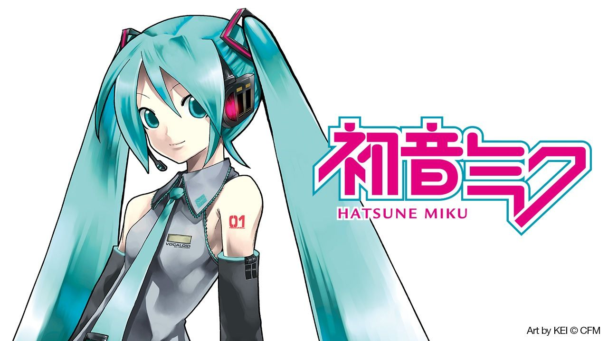

## 🌸 Miku - Your Discord + Spotify Companion

**Miku** is a light and cheerful Discord bot that connects with your Spotify account to display what you're currently listening to — directly in your server.



---

### 💡 Features

* 🎵 **Track Spotify Activity**
  Shows the song you're currently playing on Spotify via a slash command.

* 🔗 **Embeds Song Link**
  Miku posts a clickable Spotify link so others can easily check out your vibe.

* 🧠 *(Planned)* **Mood Detection**
  Miku will analyze the audio features of your current track and tell you how you're feeling, based on the song’s energy, danceability, and valence.

---

### ⚙️ Commands

| Command | Description                                                   |
| ------- | ------------------------------------------------------------- |
| `/current` | Shows the currently playing Spotify track.                    |
| `/mood` | *(In progress)* Analyzes your mood based on the current song. |

---

### 🛠️ Setup

#### 1. Clone this repo

```bash
git clone https://github.com/rakinplaban/Spotify-integrated-Discord-bot
cd Spotify-integrated-Discord-bot
```

#### 2. Create a `.env` file with your Spotify + Discord tokens:

```
SPOTIFY_CLIENT_ID=your_spotify_client_id
SPOTIFY_CLIENT_SECRET=your_spotify_client_secret
SPOTIFY_REDIRECT_URI=<url_you_want>
DISCORD_TOKEN=your_discord_bot_token
```

> You must use a Spotify Premium account to fully interact with playback features.

#### 3. Install dependencies

```bash
pip install -r requirements.txt
```

#### 4. Run the bot

```bash
python bot.py
```

---

### ✅ Requirements

* Python 3.10+
* Spotify Premium account
* Discord bot with `application.commands` enabled

---

### 👀 Screenshots


---

### 🧪 In Progress

* Mood detection with Spotify's audio analysis API
* Play/Pause controls from Discord (requires Premium)
* Custom personas and companion modes

---

### 🙋‍♀️ About Miku

Miku isn't just a bot — she's a gentle companion in your Discord world, whispering your current musical vibe to the room.

---

### 📜 License

[MIT License](LICENSE)


